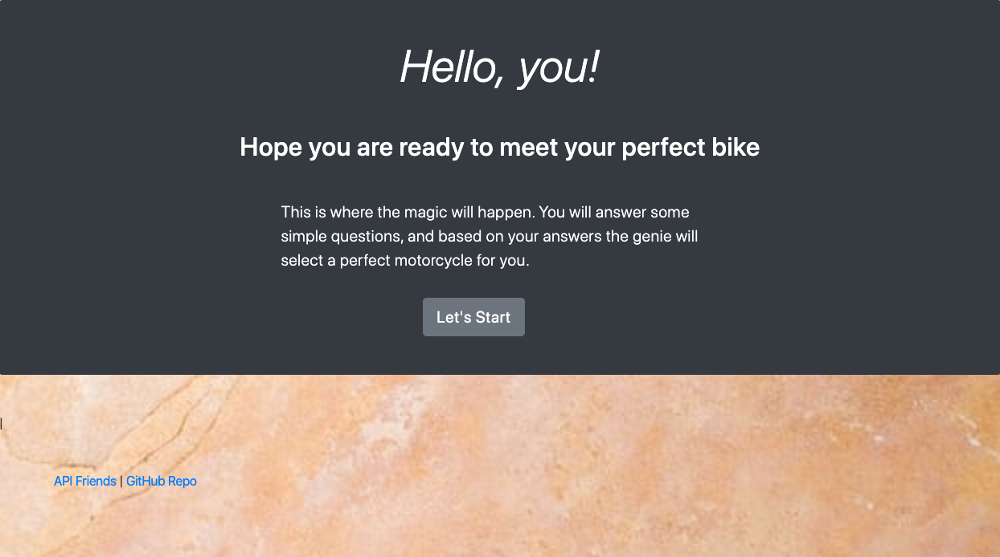
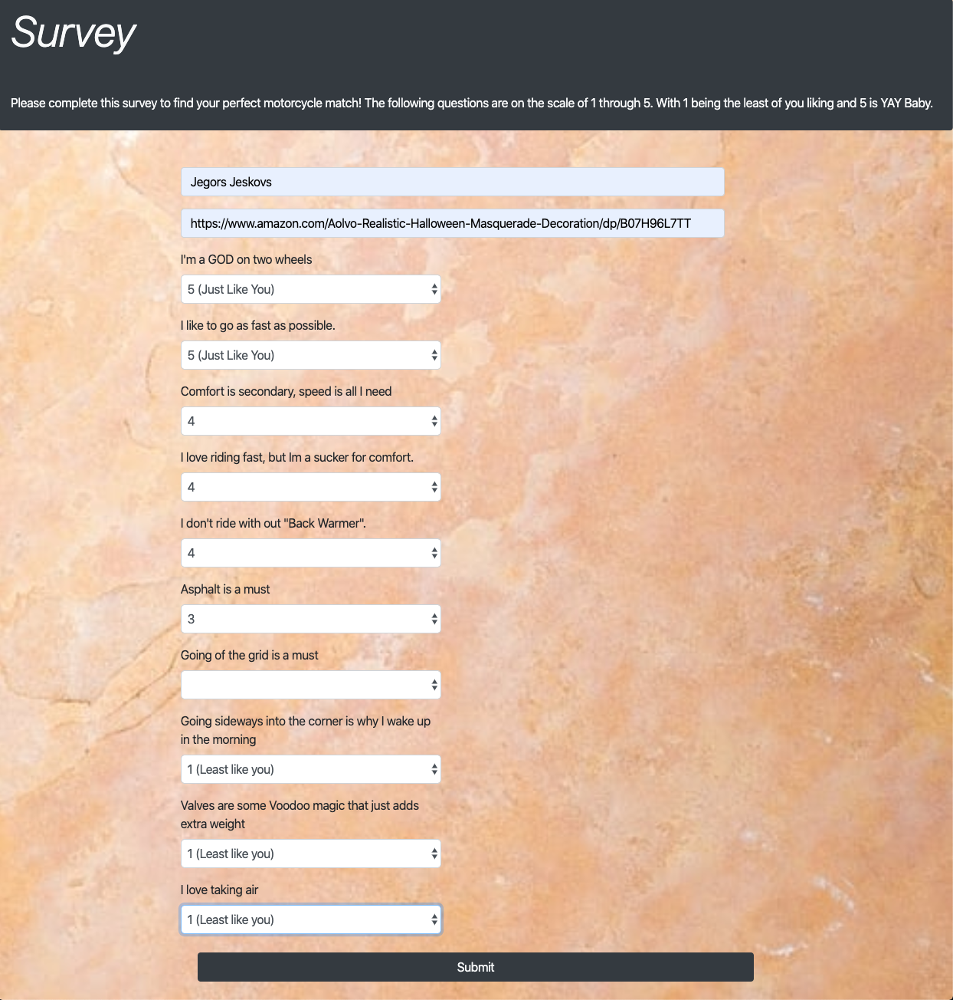
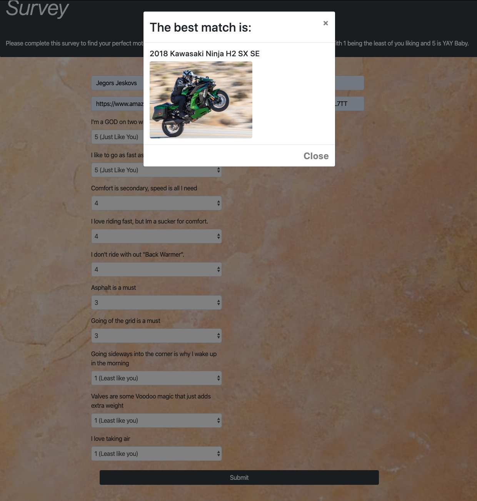

Friend Finder allows the user to take a survey and find the best friend match. And of course the best friend is your bike! What else can it be? 

## Getting Started
1. Clone the repository 
<pre>git clone git@github.com:jjeskovs/FriendFinder.git</pre>

2. Install Node.js
3. Install all the dependency by running: 
<pre>npm install</pre>

4. Running the app locally: 
<pre>node server.js</pre>

5. The app is deployed at Heroku, and can be accessed with the link below. 

<pre>https://guarded-sands-60220.herokuapp.com/</pre>

### Preview of the app: 
#### This is the landing page of the app. All the user has to do is to click the "Let's Start" button and the magic begins. 

#### This is the survey page, with the list of all 10 questions that must be answered before the user can proceed to the next page 

#### This is the final result page. The app took into consideration all the user answers and displayed the best match result. 

### Future Development 
The App will not advance forward until all the survey questions are answered, however there are currently no notification that would let the user know that the some of the questions are still need to be answered. 

## The technology used for this

* JavaScript 
* Bootstrap
* Express
* Heroku